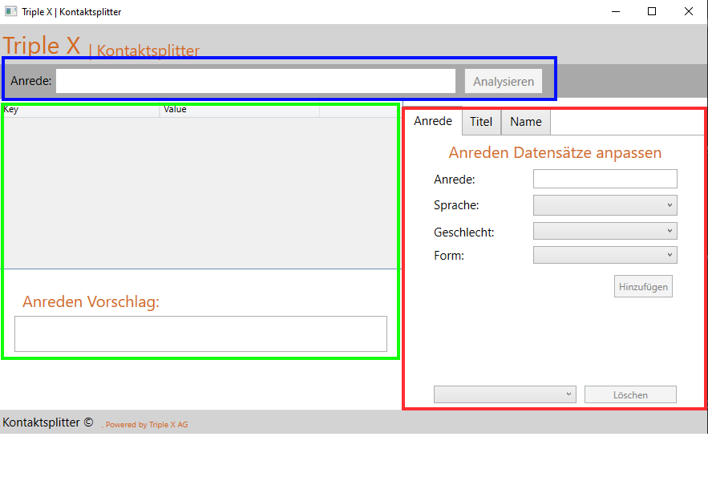

# Architektur 

## MVVM-Entwurfsmuster (View, ViewModels, ...)

Für die Trennung von Obefläche und Logik, wird das MVVM Pattern verwendet.
Als dritte Schicht wird eine Service Schicht eingeführt, welche den Analyser und den Generator enthält. 

### NameSplitterAnalyser

Der Analyser nimmt die Eingabe entgegen und separiert diese mit Hilfe der Informationen in der Datenbank.
Als Ergebnis liefert er ein Result Objekt zurück, welches die Informationen über die Separierung enthält.

### SalutationGenerator
Der Generator nimmt das Result des Analysers entgegen und generiert auf dessen Grundlage die passende Anrede.

## Oberfläche
Es können eigene Anreden, Titel und Bindewörter für den Namen ergänzt oder gelöscht werden.

* Bindewörter sind Wörter, die den Nachnamen einleiten. Beispielsweise 'van' oder 'von'.
* Anreden sind üblicherweise vor den Titeln und Namen angeführt. Beispielsweise 'Herr', 'Frau', 'Mr.', 'Sehr geehrter Herr',...
* Titel sind nach dem akademischen Grad aufgeteilt. In der automatisch generierten Ausgabe wird nur der höchste akademische Grad angeführt.  

### Blau
Hier können die Eingaben getätigt werden. 

### Rot
Hier wird die Auswertung der Analyse visualiert und der Anredenvorschlag angezeigt.

### Grün
Hier können die Informationen in der Datenbank angereichert werden. Mithilfe von Tabs kann zwischen einzelnen Kategorien ausgewählt werden.

## Speicherung
Die Speicherung der Anreden, Titel und Bindewörter wurde über eine SqLite Datenbank gelöst. Diese liegt der Exe bei und heißt: ``namesplitter.db``.
Falls diese nicht vorhanden ist wird sie mit dem passenden Schema erstellt.
